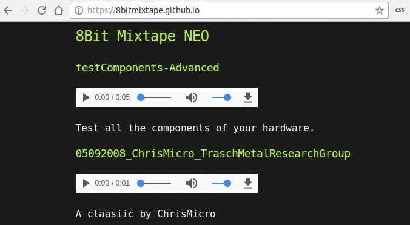

# Overview

## Uploading new codes

The key feature of the new 8Bit Mixtape is the easiness of uploading new codes using an audio communication protocol, means just playing a .wav sound file from your computer/smart phone \(or walkman\).  
A specific bootloader \([TinyAudioBoot](https://github.com/ChrisMicro/TinyAudioBoot)\) has to be installed on the chip to be able to do so. The bootloader is the first program that is started when you turn on your mixtape. you should see the right led blinking slowly. The bootloader is in waiting programmable mode for 5 seconds, and then starts the main program. If your board, doesnt blink for 5 seconds, maybe the bootloader has disappeared, see below for instructions on how to flash the bootloader \(using ISP-programming\).

https://github.com/8BitMixtape/8Bit-Mixtape-NEO/raw/master/Code/NEO_8Pixel-OneLiners/NEO_8Pixel-OneLiners.ino.wav

### Reset, play .wav -&gt; re-program your Mixtape

very very simple!

### Play pre-compiled .wav files

## Using the Arduino IDE and program yourself

### Adding the Board to the Arduino IDE

Add this line to your "**Additional Board Manager URLs**" in the Preferences \(click on the little square on the right to open an editable list\):

[http://8bitmixtape.github.io/package\_8bitmixtape\_index.json](http://8bitmixtape.github.io/package_8bitmixtape_index.json)

### Examples codes

Download this whole repository and find the path to the example codes: [https://github.com/8BitMixtape/8Bit-Mixtape-NEO/tree/master/Code](https://github.com/8BitMixtape/8Bit-Mixtape-NEO/tree/master/Code)

### Extra libraries needed

See more on [Libraries](4_1 Libraries.md)

* **8Bit Mixtape Library \(under development, included since v0.0.13\) **[https://github.com/8BitMixtape/8Bit-Mixtape-NEO](https://github.com/8BitMixtape/8Bit-Mixtape-NEO)

* **Adafruit library **[https://github.com/adafruit/Adafruit\_NeoPixel](https://github.com/adafruit/Adafruit_NeoPixel)

### Burning the Bootloader

In case you use a fresh/new attiny, you need to upload the bootloader first, before being able to use it with the Audio-Programming.

Connect an ATTINY85 to your ISP-Programmer. Arduino as ISP works also fine.

#### From Terminal

1. **Burn fuses:**

    `avrdude -P /dev/ttyACM0 -b 19200 -c avrisp -p t85 -U efuse:w:0xfe:m -U hfuse:w:0xdd:m -U lfuse:w:0xe1:m`

2. **Flash Bootloader:**

    `avrdude -v -pattiny85 -c avrisp -P/dev/ttyACM0 -b19200 -Uflash:w:/home/dusjagr/.arduino15/packages/8BitMixtape/hardware/avr/0.0.9/bootloaders/tinyaudioboot/AudioBootAttiny85_AudioPB3_LEDPB1.hex:i`

#### From Arduino IDE

Tools > Burn Bootloader

